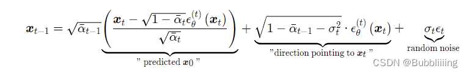

[Diffusion扩散模型学习2——Stable Diffusion结构解析-以文本生成图像为例_Bubbliiiing的博客-CSDN博客](https://blog.csdn.net/weixin_44791964/article/details/130588215)

# 源码下载地址

https://github.com/bubbliiiing/stable-diffusion

喜欢的可以点个star噢。

# 网络构建

## 一、什么是Stable Diffusion（SD）

Stable Diffusion是比较新的一个扩散模型，翻译过来是稳定扩散，虽然名字叫稳定扩散，但实际上换个seed生成的结果就完全不一样，非常不稳定哈。

Stable Diffusion最开始的应用应该是文本生成图像，即文生图，随着技术的发展Stable Diffusion不仅支持image2image图生图的生成，还支持ControlNet等各种控制方法来定制生成的图像。

Stable Diffusion基于扩散模型，所以不免包含不断去噪的过程，如果是图生图的话，还有不断加噪的过程，此时离不开DDPM那张老图，如下：


Stable Diffusion相比于DDPM，使用了DDIM采样器，使用了隐空间的扩散，另外使用了非常大的LAION-5B数据集进行预训练。

直接Finetune Stable Diffusion大多数同学应该是无法cover住成本的，不过Stable Diffusion有很多轻量Finetune的方案，比如Lora、Textual Inversion等，但这是后话。

本文主要是解析一下整个SD模型的结构组成，一次扩散，多次扩散的流程。

大模型、AIGC是当前行业的趋势，不会的话容易被淘汰，hh。

## 二、Stable Diffusion的组成

Stable Diffusion由四大部分组成。

1. Sampler采样器。

2. Variational Autoencoder (VAE) 变分自编码器。

3. UNet 主网络，噪声预测器。

4. CLIPEmbedder文本编码器。

每一部分都很重要，我们首先以文本生成图像为例进行解析。既然是文本生成图像，那么我们的输入也只剩下文本了，这时候没有输入图片。

## 三、生成流程


生成流程分为三个部分：

1. prompt文本编码。

2. 进行若干次采样。

3. 进行解码。

```python
with torch.no_grad():
    if seed == -1:
        seed = random.randint(0, 65535)
    seed_everything(seed)

    # ----------------------- #
    #   获得编码后的prompt
    # ----------------------- #
    cond    = {"c_crossattn": [model.get_learned_conditioning([prompt + ', ' + a_prompt] * num_samples)]}
    un_cond = {"c_crossattn": [model.get_learned_conditioning([n_prompt] * num_samples)]}
    H, W    = input_shape
    shape   = (4, H // 8, W // 8)

    # ----------------------- #
    #   进行采样
    # ----------------------- #
    samples, intermediates = ddim_sampler.sample(ddim_steps, num_samples,
                                                    shape, cond, verbose=False, eta=eta,
                                                    unconditional_guidance_scale=scale,
                                                    unconditional_conditioning=un_cond)

    # ----------------------- #
    #   进行解码
    # ----------------------- #
    x_samples = model.decode_first_stage(samples)
    x_samples = (einops.rearrange(x_samples, 'b c h w -> b h w c') * 127.5 + 127.5).cpu().numpy().clip(0, 255).astype(np.uint8)
```

### 1、文本编码


文本编码的思路比较简单，直接使用CLIP的文本编码器进行编码就可以了，在代码中定义了一个FrozenCLIPEmbedder类别，使用了transformers库的CLIPTokenizer和CLIPTextModel。

在前传过程中，我们对输入进来的文本首先利用CLIPTokenizer进行编码，然后使用CLIPTextModel进行特征提取，通过FrozenCLIPEmbedder，我们可以获得一个[batch_size, 77, 768]的特征向量。

```python
class FrozenCLIPEmbedder(AbstractEncoder):
    """Uses the CLIP transformer encoder for text (from huggingface)"""
    LAYERS = [
        "last",
        "pooled",
        "hidden"
    ]
    def __init__(self, version="openai/clip-vit-large-patch14", device="cuda", max_length=77,
                 freeze=True, layer="last", layer_idx=None):  # clip-vit-base-patch32
        super().__init__()
        assert layer in self.LAYERS
        # 定义文本的tokenizer和transformer
        self.tokenizer      = CLIPTokenizer.from_pretrained(version)
        self.transformer    = CLIPTextModel.from_pretrained(version)
        self.device         = device
        self.max_length     = max_length
        # 冻结模型参数
        if freeze:
            self.freeze()
        self.layer = layer
        self.layer_idx = layer_idx
        if layer == "hidden":
            assert layer_idx is not None
            assert 0 <= abs(layer_idx) <= 12

    def freeze(self):
        self.transformer = self.transformer.eval()
        # self.train = disabled_train
        for param in self.parameters():
            param.requires_grad = False

    def forward(self, text):
        # 对输入的图片进行分词并编码，padding直接padding到77的长度。
        batch_encoding  = self.tokenizer(text, truncation=True, max_length=self.max_length, return_length=True,
                                        return_overflowing_tokens=False, padding="max_length", return_tensors="pt")
        # 拿出input_ids然后传入transformer进行特征提取。
        tokens          = batch_encoding["input_ids"].to(self.device)
        outputs         = self.transformer(input_ids=tokens, output_hidden_states=self.layer=="hidden")
        # 取出所有的token
        if self.layer == "last":
            z = outputs.last_hidden_state
        elif self.layer == "pooled":
            z = outputs.pooler_output[:, None, :]
        else:
            z = outputs.hidden_states[self.layer_idx]
        return z

    def encode(self, text):
        return self(text)
```

### 2、采样流程


#### a、生成初始噪声

既然输入里面只有文本，没有输入图片，那么最初始的噪声哪里来？

在这里直接搞个正态分布的噪声就可以了，简单理解就是：**既然在训练的时候就是不断的给原图加正态分布噪声得到最终的噪声矩阵，那么我直接初始化一个 正态分布的噪声 作为 初始噪声 生成图片很合理吧**。

在代码里面其实也是这么做的，不过因为我们是在**隐空间**去进行扩散的，所以我们生成的噪声也是相对于**隐空间**的。

在这里简单介绍一下VAE，VAE是变分自编码器，可以将输入图片进行编码，**一个高宽原本为512x512x3的图片在使用VAE编码后会变成64x64x4**，**这个4是人为设定的，不必纠结为什么不是3**。这个时候我们就使用一个简单的矩阵代替原有的512x512x3的图片了，传输与存储成本就很低。**在实际要去看的时候，可以对64x64x4的矩阵进行解码，获得512x512x3的图片。**

因此，如果 我们生成的噪声是相对于**隐空间**的，同时我们要生成一个512x512x3的图片，那么我们就要初始化一个64x64x4的隐向量，我们在隐空间扩散好后，**再使用解码器就可以生成512x512x3的图像。**

在代码中，我们确实是这么做的，初始噪声的生成代码为：

```python
img = torch.randn(shape, device=device)
```

代码位于ldm.models.diffusion.ddim.py中的ddim_sampling方法中。shape是外面传进来的，大小为`[4, 64, 64]`。

```python
    @torch.no_grad()
    def ddim_sampling(self, cond, shape,
                      x_T=None, ddim_use_original_steps=False,
                      callback=None, timesteps=None, quantize_denoised=False,
                      mask=None, x0=None, img_callback=None, log_every_t=100,
                      temperature=1., noise_dropout=0., score_corrector=None, corrector_kwargs=None,
                      unconditional_guidance_scale=1., unconditional_conditioning=None,):
        device = self.model.betas.device
        b = shape[0]
        # 生成隐空间的初始向量，文生图。
        # 或者直接使用传入进来的x_T，图生图。
        if x_T is None:
            img = torch.randn(shape, device=device) # [B, 4, 64, 64]
        else:
            img = x_T
```

#### b、对噪声进行N次采样

既然Stable Diffusion是一个不断扩散的过程，那么少不了不断的去噪声，那么怎么去噪声便是一个问题。

在上一步中，我们已经获得了一个img，它是一个符合正态分布的向量，我们便从它开始去噪声。

我们会对ddim_timesteps的时间步取反，因为我们现在是去噪声而非加噪声，然后对其进行一个循环，循环的代码如下：

**循环中有一个mask，它的作用是用于进行局部的重建，对部分区域的隐向量进行mask，此处没用到**。其它东西都是个方法或者函数，也看不出东西来。**在这里面看起来最像采样过程的就是p_sample_ddim方法，我们需要进入p_sample_ddim这个方法看看。**

```python
for i, step in enumerate(iterator):
    # index是用来取得对应的调节参数的
    index   = total_steps - i - 1
    # 将步数拓展到bs维度
    ts      = torch.full((b,), step, device=device, dtype=torch.long)

    # 用于进行局部的重建，对部分区域的隐向量进行mask。
    if mask is not None:
        assert x0 is not None
        img_orig = self.model.q_sample(x0, ts)  # TODO: deterministic forward pass?
        img = img_orig * mask + (1. - mask) * img

    # 进行采样
    outs = self.p_sample_ddim(img, cond, ts, index=index, use_original_steps=ddim_use_original_steps,
                                quantize_denoised=quantize_denoised, temperature=temperature,
                                noise_dropout=noise_dropout, score_corrector=score_corrector,
                                corrector_kwargs=corrector_kwargs,
                                unconditional_guidance_scale=unconditional_guidance_scale,
                                unconditional_conditioning=unconditional_conditioning)
    img, pred_x0 = outs
    # 回调函数
    if callback: callback(i)
    if img_callback: img_callback(pred_x0, i)

    if index % log_every_t == 0 or index == total_steps - 1:
        intermediates['x_inter'].append(img)
        intermediates['pred_x0'].append(pred_x0)
```

#### c、单次采样解析

##### I、预测噪声

在进行单词采样前，需要首先判断是否有neg prompt，如果有，我们需要同时处理neg prompt，否则仅仅需要处理pos prompt。实际使用的时候一般都有neg prompt（效果会好一些），所以默认进入对应的处理过程。

在处理neg prompt时，我们对输入进来的隐向量和步数进行复制，一个属于pos prompt，一个属于neg prompt。torch.cat默认堆叠维度为0，所以是在batch_size维度进行堆叠，二者不会互相影响。然后我们将pos prompt和neg prompt堆叠到一个batch中，也是在batch_size维度堆叠。

```python
# 首先判断是否由neg prompt，unconditional_conditioning是由neg prompt获得的
if unconditional_conditioning is None or unconditional_guidance_scale == 1.:
    e_t = self.model.apply_model(x, t, c)
else:
    # 一般都是有neg prompt的，所以进入到这里
    # 在这里我们对隐向量和步数进行复制，一个属于pos prompt，一个属于neg prompt
    # torch.cat默认堆叠维度为0，所以是在bs维度进行堆叠，二者不会互相影响
    x_in = torch.cat([x] * 2)   # [B, 4, 64, 64] ->  [2*B, 4, 64, 64]
    t_in = torch.cat([t] * 2)   # [B] -> [2*B]
    # 然后我们将pos prompt和neg prompt堆叠到一个batch中
    if isinstance(c, dict):
        assert isinstance(unconditional_conditioning, dict)
        c_in = dict()
        for k in c:
            if isinstance(c[k], list):
                c_in[k] = [
                    torch.cat([unconditional_conditioning[k][i], c[k][i]])
                    for i in range(len(c[k]))
                ]
            else:
                c_in[k] = torch.cat([unconditional_conditioning[k], c[k]])
    else:
        c_in = torch.cat([unconditional_conditioning, c])
```

堆叠完后，我们将隐向量、步数和prompt条件一起传入网络中，将结果在bs维度进行使用chunk进行分割。

因为我们在堆叠时，neg prompt放在了前面。因此分割好后，前半部分`e_t_uncond`属于利用neg prompt得到的，后半部分`e_t`属于利用pos prompt得到的，我们本质上应该**扩大pos prompt的影响，远离neg prompt的影响**。注意`e_t`代表使用正向提示词的文本，是`cond`的，而`e_t_uncond`代表使用负向提示词且没有文本条件的文本，是`uncond`的。因此，我们使用`e_t-e_t_uncond`计算二者的距离，使用scale扩大二者的距离。在e_t_uncond基础上，得到最后的隐向量。

```python
# 堆叠完后，隐向量、步数和prompt条件一起传入网络中，将结果在bs维度进行使用chunk进行分割
e_t_uncond, e_t = self.model.apply_model(x_in, t_in, c_in).chunk(2)
# 使用 e_t-e_t_uncond 计算二者的距离，使用 scale 扩大二者的距离，在 e_t_uncond 基础上，得到最后的隐向量。
e_t = e_t_uncond + unconditional_guidance_scale * (e_t - e_t_uncond)

# 另一种理解的方式,类似动量
e_t = unconditional_guidance_scale * e_t + (1 - unconditional_guidance_scale) * e_t_uncond
```

此时获得的e_t就是通过隐向量和prompt共同获得的预测噪声啦。

##### II、施加噪声

获得噪声就OK了吗？显然不是的，我们还要将获得的新噪声，按照一定的比例添加到原来的原始噪声上。

这个地方我们最好结合ddim中的公式来看，我们需要获得 $\bar{\alpha}_t$、$\bar{\alpha}_{t-1}$、$\sigma_t$ 、$\sqrt{1-\bar{\alpha}_t}$ 。




代码中，我们其实已经预先计算好了这些参数。我们只需要直接取出即可，下方的a_t也就是公式中括号外的 $\bar{\alpha}_t$  ，a_prev 就是公式中的 $ \bar{\alpha}_{t-1}$ ，sigma_t就是公式中的 $\sigma_t$ ，sqrt_one_minus_at就是公式中的 $\sqrt{1-\bar{\alpha}_t}$ 。

```python
# 根据采样器选择参数
alphas      = self.model.alphas_cumprod if use_original_steps else self.ddim_alphas
alphas_prev = self.model.alphas_cumprod_prev if use_original_steps else self.ddim_alphas_prev
sqrt_one_minus_alphas = self.model.sqrt_one_minus_alphas_cumprod if use_original_steps else self.ddim_sqrt_one_minus_alphas
sigmas      = self.model.ddim_sigmas_for_original_num_steps if use_original_steps else self.ddim_sigmas

# 根据步数选择参数，
# 这里的index就是上面循环中的total_steps - i - 1
a_t         = torch.full((b, 1, 1, 1), alphas[index], device=device)
a_prev      = torch.full((b, 1, 1, 1), alphas_prev[index], device=device)
sigma_t     = torch.full((b, 1, 1, 1), sigmas[index], device=device)
sqrt_one_minus_at = torch.full((b, 1, 1, 1), sqrt_one_minus_alphas[index],device=device)
```

其实这一步我们只是把公式需要用到的系数全都拿了出来，方便后面的加减乘除。然后我们便在代码中实现上述的公式。

```python
# current prediction for x_0
# 公式中的最左边
pred_x0             = (x - sqrt_one_minus_at * e_t) / a_t.sqrt()
if quantize_denoised:
    pred_x0, _, *_  = self.model.first_stage_model.quantize(pred_x0)
# direction pointing to x_t
# 公式的中间
dir_xt              = (1. - a_prev - sigma_t**2).sqrt() * e_t
# 公式最右边
noise               = sigma_t * noise_like(x.shape, device, repeat_noise) * temperature
if noise_dropout > 0.:
    noise           = torch.nn.functional.dropout(noise, p=noise_dropout)
x_prev              = a_prev.sqrt() * pred_x0 + dir_xt + noise
# 输出添加完公式的结果
return x_prev, pred_x0
```

#### d、预测噪声过程中的网络结构解析

##### I、apply_model方法解析

在3.a的预测噪声过程中，我们使用了model.apply_model方法进行噪声的预测，这个方法具体做了什么被隐掉了，我们看看具体做的工作。

apply_model方法在ldm.models.diffusion.ddpm.py文件中。在apply_model中，我们将x_noisy传入self.model中预测噪声。

```python
x_recon = self.model(x_noisy, t, **cond)
```

```python
def apply_model(self, x_noisy, t, cond, return_ids=False):
    if isinstance(cond, dict):
        # hybrid case, cond is expected to be a dict
        pass
    else:
        if not isinstance(cond, list):
            cond = [cond]
        key = 'c_concat' if self.model.conditioning_key == 'concat' else 'c_crossattn'
        cond = {key: cond}
    # 将x_noisy传入self.model中
    x_recon = self.model(x_noisy, t, **cond)

    if isinstance(x_recon, tuple) and not return_ids:
        return x_recon[0]
    else:
        return x_recon
```

self.model是一个预先构建好的类，定义在ldm.models.diffusion.ddpm.py文件的1416行，内部包含Stable Diffusion的Unet网络，self.model的功能有点类似于包装器，根据模型选择的特征融合方式，进行文本与上文生成的噪声的融合。

c_concat代表使用堆叠的方式进行融合，c_crossattn代表使用attention的方式融合。

```python
class DiffusionWrapper(pl.LightningModule):
    def __init__(self, diff_model_config, conditioning_key):
        super().__init__()
        self.sequential_cross_attn = diff_model_config.pop("sequential_crossattn", False)
        # stable diffusion的unet网络
        self.diffusion_model = instantiate_from_config(diff_model_config)
        self.conditioning_key = conditioning_key
        assert self.conditioning_key in [None, 'concat', 'crossattn', 'hybrid', 'adm', 'hybrid-adm', 'crossattn-adm']

    def forward(self, x, t, c_concat: list = None, c_crossattn: list = None, c_adm=None):
        if self.conditioning_key is None:
            out = self.diffusion_model(x, t)
        elif self.conditioning_key == 'concat':
            xc = torch.cat([x] + c_concat, dim=1)
            out = self.diffusion_model(xc, t)
        elif self.conditioning_key == 'crossattn':
            if not self.sequential_cross_attn:
                cc = torch.cat(c_crossattn, 1)
            else:
                cc = c_crossattn
            out = self.diffusion_model(x, t, context=cc)
        elif self.conditioning_key == 'hybrid':
            xc = torch.cat([x] + c_concat, dim=1)
            cc = torch.cat(c_crossattn, 1)
            out = self.diffusion_model(xc, t, context=cc)
        elif self.conditioning_key == 'hybrid-adm':
            assert c_adm is not None
            xc = torch.cat([x] + c_concat, dim=1)
            cc = torch.cat(c_crossattn, 1)
            out = self.diffusion_model(xc, t, context=cc, y=c_adm)
        elif self.conditioning_key == 'crossattn-adm':
            assert c_adm is not None
            cc = torch.cat(c_crossattn, 1)
            out = self.diffusion_model(x, t, context=cc, y=c_adm)
        elif self.conditioning_key == 'adm':
            cc = c_crossattn[0]
            out = self.diffusion_model(x, t, y=cc)
        else:
            raise NotImplementedError()

        return out
```

代码中的self.diffusion_model便是Stable Diffusion的Unet网络，网络结构位于ldm.modules.diffusionmodules.openaimodel.py文件中的UNetModel类。

##### II、UNetModel模型解析

**UNetModel主要做的工作是结合时间步t和文本Embedding计算这一时刻的噪声**。尽管UNet的思路非常简单，但是在StableDiffusion中，UNetModel由ResBlock和Transformer模块组成，整体来讲相比于普通的UNet复杂一些。

Prompt通过Frozen CLIP Text Encoder获得Text Embedding，Timesteps通过全连接（MLP）获得Timesteps Embedding；

ResBlock用于结合时间步Timesteps Embedding，Transformer模块用于结合文本Text Embedding。

我在这里放一张大图，同学们可以看到内部shape的变化。


Unet代码如下所示：

```python
class UNetModel(nn.Module):
    """
    The full UNet model with attention and timestep embedding.
    :param in_channels: channels in the input Tensor.
    :param model_channels: base channel count for the model.
    :param out_channels: channels in the output Tensor.
    :param num_res_blocks: number of residual blocks per downsample.
    :param attention_resolutions: a collection of downsample rates at which
        attention will take place. May be a set, list, or tuple.
        For example, if this contains 4, then at 4x downsampling, attention
        will be used.
    :param dropout: the dropout probability.
    :param channel_mult: channel multiplier for each level of the UNet.
    :param conv_resample: if True, use learned convolutions for upsampling and
        downsampling.
    :param dims: determines if the signal is 1D, 2D, or 3D.
    :param num_classes: if specified (as an int), then this model will be
        class-conditional with `num_classes` classes.
    :param use_checkpoint: use gradient checkpointing to reduce memory usage.
    :param num_heads: the number of attention heads in each attention layer.
    :param num_heads_channels: if specified, ignore num_heads and instead use
                               a fixed channel width per attention head.
    :param num_heads_upsample: works with num_heads to set a different number
                               of heads for upsampling. Deprecated.
    :param use_scale_shift_norm: use a FiLM-like conditioning mechanism.
    :param resblock_updown: use residual blocks for up/downsampling.
    :param use_new_attention_order: use a different attention pattern for potentially
                                    increased efficiency.
    """

    def __init__(
        self,
        image_size,
        in_channels,
        model_channels,
        out_channels,
        num_res_blocks,
        attention_resolutions,
        dropout=0,
        channel_mult=(1, 2, 4, 8),
        conv_resample=True,
        dims=2,
        num_classes=None,
        use_checkpoint=False,
        use_fp16=False,
        num_heads=-1,
        num_head_channels=-1,
        num_heads_upsample=-1,
        use_scale_shift_norm=False,
        resblock_updown=False,
        use_new_attention_order=False,
        use_spatial_transformer=False,    # custom transformer support
        transformer_depth=1,              # custom transformer support
        context_dim=None,                 # custom transformer support
        n_embed=None,                     # custom support for prediction of discrete ids into codebook of first stage vq model
        legacy=True,
    ):
        super().__init__()
        if use_spatial_transformer:
            assert context_dim is not None, 'Fool!! You forgot to include the dimension of your cross-attention conditioning...'

        if context_dim is not None:
            assert use_spatial_transformer, 'Fool!! You forgot to use the spatial transformer for your cross-attention conditioning...'
            from omegaconf.listconfig import ListConfig
            if type(context_dim) == ListConfig:
                context_dim = list(context_dim)

        if num_heads_upsample == -1:
            num_heads_upsample = num_heads

        if num_heads == -1:
            assert num_head_channels != -1, 'Either num_heads or num_head_channels has to be set'

        if num_head_channels == -1:
            assert num_heads != -1, 'Either num_heads or num_head_channels has to be set'

        self.image_size = image_size
        self.in_channels = in_channels
        self.model_channels = model_channels
        self.out_channels = out_channels
        self.num_res_blocks = num_res_blocks
        self.attention_resolutions = attention_resolutions
        self.dropout = dropout
        self.channel_mult = channel_mult
        self.conv_resample = conv_resample
        self.num_classes = num_classes
        self.use_checkpoint = use_checkpoint
        self.dtype = th.float16 if use_fp16 else th.float32
        self.num_heads = num_heads
        self.num_head_channels = num_head_channels
        self.num_heads_upsample = num_heads_upsample
        self.predict_codebook_ids = n_embed is not None

        # 用于计算当前采样时间t的embedding
        time_embed_dim  = model_channels * 4
        self.time_embed = nn.Sequential(
            linear(model_channels, time_embed_dim),
            nn.SiLU(),
            linear(time_embed_dim, time_embed_dim),
        )

        if self.num_classes is not None:
            self.label_emb = nn.Embedding(num_classes, time_embed_dim)
        
        # 定义输入模块的第一个卷积
        # TimestepEmbedSequential也可以看作一个包装器，根据层的种类进行时间或者文本的融合。
        self.input_blocks = nn.ModuleList(
            [
                TimestepEmbedSequential(
                    conv_nd(dims, in_channels, model_channels, 3, padding=1)
                )
            ]
        )
        self._feature_size  = model_channels
        input_block_chans   = [model_channels]
        ch                  = model_channels
        ds                  = 1
        # 对channel_mult进行循环，channel_mult一共有四个值，代表unet四个部分通道的扩张比例
        # [1, 2, 4, 4]
        for level, mult in enumerate(channel_mult):
            # 每个部分循环两次
            # 添加一个ResBlock和一个AttentionBlock
            for _ in range(num_res_blocks):
                # 先添加一个ResBlock
                # 用于对输入的噪声进行通道数的调整，并且融合t的特征
                layers = [
                    ResBlock(
                        ch,
                        time_embed_dim,
                        dropout,
                        out_channels=mult * model_channels,
                        dims=dims,
                        use_checkpoint=use_checkpoint,
                        use_scale_shift_norm=use_scale_shift_norm,
                    )
                ]
                # ch便是上述ResBlock的输出通道数
                ch = mult * model_channels
                if ds in attention_resolutions:
                    # num_heads=8
                    if num_head_channels == -1:
                        dim_head = ch // num_heads
                    else:
                        num_heads = ch // num_head_channels
                        dim_head = num_head_channels
                    if legacy:
                        #num_heads = 1
                        dim_head = ch // num_heads if use_spatial_transformer else num_head_channels
                    # 使用了SpatialTransformer自注意力，加强全局特征，融合文本的特征
                    layers.append(
                        AttentionBlock(
                            ch,
                            use_checkpoint=use_checkpoint,
                            num_heads=num_heads,
                            num_head_channels=dim_head,
                            use_new_attention_order=use_new_attention_order,
                        ) if not use_spatial_transformer else SpatialTransformer(
                            ch, num_heads, dim_head, depth=transformer_depth, context_dim=context_dim
                        )
                    )
                self.input_blocks.append(TimestepEmbedSequential(*layers))
                self._feature_size += ch
                input_block_chans.append(ch)
            # 如果不是四个部分中的最后一个部分，那么都要进行下采样。
            if level != len(channel_mult) - 1:
                out_ch = ch
                # 在此处进行下采样
                # 一般直接使用Downsample模块
                self.input_blocks.append(
                    TimestepEmbedSequential(
                        ResBlock(
                            ch,
                            time_embed_dim,
                            dropout,
                            out_channels=out_ch,
                            dims=dims,
                            use_checkpoint=use_checkpoint,
                            use_scale_shift_norm=use_scale_shift_norm,
                            down=True,
                        )
                        if resblock_updown
                        else Downsample(
                            ch, conv_resample, dims=dims, out_channels=out_ch
                        )
                    )
                )
                # 为下一阶段定义参数。
                ch = out_ch
                input_block_chans.append(ch)
                ds *= 2
                self._feature_size += ch

        if num_head_channels == -1:
            dim_head = ch // num_heads
        else:
            num_heads = ch // num_head_channels
            dim_head = num_head_channels
        if legacy:
            #num_heads = 1
            dim_head = ch // num_heads if use_spatial_transformer else num_head_channels
        # 定义中间层
        # ResBlock + SpatialTransformer + ResBlock
        self.middle_block = TimestepEmbedSequential(
            ResBlock(
                ch,
                time_embed_dim,
                dropout,
                dims=dims,
                use_checkpoint=use_checkpoint,
                use_scale_shift_norm=use_scale_shift_norm,
            ),
            AttentionBlock(
                ch,
                use_checkpoint=use_checkpoint,
                num_heads=num_heads,
                num_head_channels=dim_head,
                use_new_attention_order=use_new_attention_order,
            ) if not use_spatial_transformer else SpatialTransformer(
                            ch, num_heads, dim_head, depth=transformer_depth, context_dim=context_dim
                        ),
            ResBlock(
                ch,
                time_embed_dim,
                dropout,
                dims=dims,
                use_checkpoint=use_checkpoint,
                use_scale_shift_norm=use_scale_shift_norm,
            ),
        )
        self._feature_size += ch

        # 定义Unet上采样过程
        self.output_blocks = nn.ModuleList([])
        # 循环把channel_mult反了过来
        for level, mult in list(enumerate(channel_mult))[::-1]:
            # 上采样时每个部分循环三次
            for i in range(num_res_blocks + 1):
                ich = input_block_chans.pop()
                # 首先添加ResBlock层
                layers = [
                    ResBlock(
                        ch + ich,
                        time_embed_dim,
                        dropout,
                        out_channels=model_channels * mult,
                        dims=dims,
                        use_checkpoint=use_checkpoint,
                        use_scale_shift_norm=use_scale_shift_norm,
                    )
                ]
                ch = model_channels * mult
                # 然后进行SpatialTransformer自注意力
                if ds in attention_resolutions:
                    if num_head_channels == -1:
                        dim_head = ch // num_heads
                    else:
                        num_heads = ch // num_head_channels
                        dim_head = num_head_channels
                    if legacy:
                        #num_heads = 1
                        dim_head = ch // num_heads if use_spatial_transformer else num_head_channels
                    layers.append(
                        AttentionBlock(
                            ch,
                            use_checkpoint=use_checkpoint,
                            num_heads=num_heads_upsample,
                            num_head_channels=dim_head,
                            use_new_attention_order=use_new_attention_order,
                        ) if not use_spatial_transformer else SpatialTransformer(
                            ch, num_heads, dim_head, depth=transformer_depth, context_dim=context_dim
                        )
                    )
                # 如果不是channel_mult循环的第一个
                # 且
                # 是num_res_blocks循环的最后一次，则进行上采样
                if level and i == num_res_blocks:
                    out_ch = ch
                    layers.append(
                        ResBlock(
                            ch,
                            time_embed_dim,
                            dropout,
                            out_channels=out_ch,
                            dims=dims,
                            use_checkpoint=use_checkpoint,
                            use_scale_shift_norm=use_scale_shift_norm,
                            up=True,
                        )
                        if resblock_updown
                        else Upsample(ch, conv_resample, dims=dims, out_channels=out_ch)
                    )
                    ds //= 2
                self.output_blocks.append(TimestepEmbedSequential(*layers))
                self._feature_size += ch

        # 最后在输出部分进行一次卷积
        self.out = nn.Sequential(
            normalization(ch),
            nn.SiLU(),
            zero_module(conv_nd(dims, model_channels, out_channels, 3, padding=1)),
        )
        if self.predict_codebook_ids:
            self.id_predictor = nn.Sequential(
            normalization(ch),
            conv_nd(dims, model_channels, n_embed, 1),
            #nn.LogSoftmax(dim=1)  # change to cross_entropy and produce non-normalized logits
        )

    def convert_to_fp16(self):
        """
        Convert the torso of the model to float16.
        """
        self.input_blocks.apply(convert_module_to_f16)
        self.middle_block.apply(convert_module_to_f16)
        self.output_blocks.apply(convert_module_to_f16)

    def convert_to_fp32(self):
        """
        Convert the torso of the model to float32.
        """
        self.input_blocks.apply(convert_module_to_f32)
        self.middle_block.apply(convert_module_to_f32)
        self.output_blocks.apply(convert_module_to_f32)

    def forward(self, x, timesteps=None, context=None, y=None,**kwargs):
        """
        Apply the model to an input batch.
        :param x: an [N x C x ...] Tensor of inputs.
        :param timesteps: a 1-D batch of timesteps.
        :param context: conditioning plugged in via crossattn
        :param y: an [N] Tensor of labels, if class-conditional.
        :return: an [N x C x ...] Tensor of outputs.
        """
        assert (y is not None) == (
            self.num_classes is not None
        ), "must specify y if and only if the model is class-conditional"
        hs      = []
        # 用于计算当前采样时间t的embedding
        t_emb   = timestep_embedding(timesteps, self.model_channels, repeat_only=False)
        emb     = self.time_embed(t_emb)

        if self.num_classes is not None:
            assert y.shape == (x.shape[0],)
            emb = emb + self.label_emb(y)

        # 对输入模块进行循环，进行下采样并且融合时间特征与文本特征。
        h = x.type(self.dtype)
        for module in self.input_blocks:
            h = module(h, emb, context)
            hs.append(h)

        # 中间模块的特征提取
        h = self.middle_block(h, emb, context)

        # 上采样模块的特征提取
        for module in self.output_blocks:
            h = th.cat([h, hs.pop()], dim=1)
            h = module(h, emb, context)
        h = h.type(x.dtype)
        # 输出模块
        if self.predict_codebook_ids:
            return self.id_predictor(h)
        else:
            return self.out(h)
```

### 3、隐空间解码生成图片


通过上述步骤，已经可以多次采样获得结果，然后我们便可以通过隐空间解码生成图片。

隐空间解码生成图片的过程非常简单，将上文多次采样后的结果，使用decode_first_stage方法即可生成图片。

在decode_first_stage方法中，网络调用VAE对获取到的64x64x3的隐向量进行解码，获得512x512x3的图片。

```python
@torch.no_grad()
def decode_first_stage(self, z, predict_cids=False, force_not_quantize=False):
    if predict_cids:
        if z.dim() == 4:
            z = torch.argmax(z.exp(), dim=1).long()
        z = self.first_stage_model.quantize.get_codebook_entry(z, shape=None)
        z = rearrange(z, 'b h w c -> b c h w').contiguous()

    z = 1. / self.scale_factor * z
	# 一般无需分割输入，所以直接将x_noisy传入self.model中，在下面else进行
    if hasattr(self, "split_input_params"):
    	......
    else:
        if isinstance(self.first_stage_model, VQModelInterface):
            return self.first_stage_model.decode(z, force_not_quantize=predict_cids or force_not_quantize)
        else:
            return self.first_stage_model.decode(z)
```

# 文本到图像预测过程代码

整体预测代码如下：

```python
import random

import einops
import numpy as np
import torch
import cv2
import os
from ldm_hacked import DDIMSampler
from ldm_hacked import create_model, load_state_dict, DDIMSampler
from pytorch_lightning import seed_everything

# ----------------------- #
#   使用的参数
# ----------------------- #
# config的地址
config_path = "model_data/sd_v15.yaml"
# 模型的地址
model_path  = "model_data/v1-5-pruned-emaonly.safetensors"

# 生成的图像大小为input_shape
input_shape = [512, 512]
# 一次生成几张图像
num_samples = 2
# 采样的步数
ddim_steps  = 20
# 采样的种子，为-1的话则随机。
seed        = 12345
# eta
eta         = 0

# 提示词
prompt      = "a cat"
# 正面提示词
a_prompt    = "best quality, extremely detailed"
# 负面提示词
n_prompt    = "longbody, lowres, bad anatomy, bad hands, missing fingers, extra digit, fewer digits, cropped, worst quality, low quality"
# 正负扩大倍数
scale       = 9

# save_path
save_path   = "imgs/outputs_imgs"

# ----------------------- #
#   创建模型
# ----------------------- #
model   = create_model(config_path).cpu()
model.load_state_dict(load_state_dict(model_path, location='cuda'), strict=False)
model   = model.cuda()
ddim_sampler = DDIMSampler(model)

with torch.no_grad():
    if seed == -1:
        seed = random.randint(0, 65535)
    seed_everything(seed)

    # ----------------------- #
    #   获得编码后的prompt
    # ----------------------- #
    cond    = {"c_crossattn": [model.get_learned_conditioning([prompt + ', ' + a_prompt] * num_samples)]}
    un_cond = {"c_crossattn": [model.get_learned_conditioning([n_prompt] * num_samples)]}
    H, W    = input_shape
    shape   = (4, H // 8, W // 8)

    # ----------------------- #
    #   进行采样
    # ----------------------- #
    samples, intermediates = ddim_sampler.sample(ddim_steps, num_samples,
                                                    shape, cond, verbose=False, eta=eta,
                                                    unconditional_guidance_scale=scale,
                                                    unconditional_conditioning=un_cond)

    # ----------------------- #
    #   进行解码
    # ----------------------- #
    x_samples = model.decode_first_stage(samples)
    x_samples = (einops.rearrange(x_samples, 'b c h w -> b h w c') * 127.5 + 127.5).cpu().numpy().clip(0, 255).astype(np.uint8)

# ----------------------- #
#   保存图片
# ----------------------- #
if not os.path.exists(save_path):
    os.makedirs(save_path)
for index, image in enumerate(x_samples):
    cv2.imwrite(os.path.join(save_path, str(index) + ".jpg"), cv2.cvtColor(image, cv2.COLOR_BGR2RGB))
```

