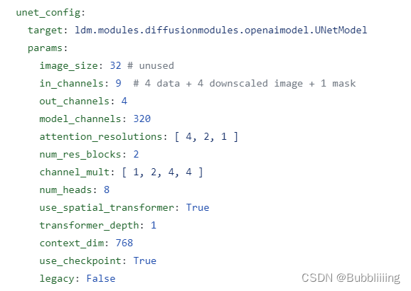

https://blog.csdn.net/weixin_44791964/article/details/131997973

# 源码下载地址

https://github.com/bubbliiiing/stable-diffusion

喜欢的可以点个star噢。

## 一、先验知识

txt2img的原理如博文
[Diffusion扩散模型学习2——Stable Diffusion结构解析-以文本生成图像（文生图，txt2img）为例](https://blog.csdn.net/weixin_44791964/article/details/130588215)

img2img的原理如博文
[Diffusion扩散模型学习3——Stable Diffusion结构解析-以图像生成图像（图生图，img2img）为例](https://blog.csdn.net/weixin_44791964/article/details/131992399)

## 二、什么是inpaint

Inpaint是一项图片修复技术，可以从图片上去除不必要的物体，让您轻松摆脱照片上的水印、划痕、污渍、标志等瑕疵。

一般来讲，图片的inpaint过程可以理解为两步：

1. 找到图片中的需要重绘的部分，比如上述提到的**水印、划痕、污渍、标志等**。

2. 去掉**水印、划痕、污渍、标志等**，自动填充图片应该有的内容。

## 三、Stable Diffusion中的inpaint

Stable Diffusion中的inpaint的实现方式有两种：

### 1、开源的inpaint模型

[参考链接：inpaint_st.py](https://github.com/runwayml/stable-diffusion/blob/main/scripts/inpaint_st.py)，该模型经过特定的训练。需要输入符合需求的图片才可以进行inpaint。

需要注意的是，该模型使用的config文件发生了改变，改为[v1-inpainting-inference.yaml](https://github.com/runwayml/stable-diffusion/blob/main/configs/stable-diffusion/v1-inpainting-inference.yaml)。**其中最显著的区别就是unet_config的in_channels从4变成了9**。相比于原来的4，我们增加了4+1（5）个通道的信息。



4+1（5）个通道的信息应该是什么呢？一个是**被mask后的图像**，对应其中的4；一个是**mask的图像**，对应其中的1。

1. **我们首先把图片中需要inpaint的部分给置为0**，获得**被mask后的图像**，然后利用VAE编码，VAE输出通道为4，假设**被mask的图像是[512, 512, 3]**，此时我们获得了一个[4, 64, 64]的隐含层特征，对应其中的4。

2. 然后需要对mask进行**下采样**，采样到和隐含层特征一样的高宽，即mask的shape为[1, 512, 512]，利用下采样获得[1, 64, 64]的mask。本质上，我们获得了**隐含层的mask**。

3. 然后我们将 下**采样后的被mask的图像** 和 **隐含层的mask** 在通道上做一个堆叠，获得一个[5, 64, 64]的特征，然后将此特征与**随机初始化的高斯噪声堆叠**，则获得了上述图片中的9通道特征。

**此后采样的过程与常规采样方式一样**，全部采样完成后，使用VAE解码，获得inpaint后的图像。

**可以感受到上述的方式必须基于一个已经训练好的unet模型，这要求训练者需要有足够的算力去完成这一个工作，对大众开发者而言并不友好。因此该方法很少在实际中得到使用。**

### 2、基于base模型inpaint

如果我们必须训练一个inpaint模型才能对当前的模型进行inpaint，那就太麻烦了，有没有什么方法可以不需要训练就能inpaint呢？

诶诶，当然有哈。

Stable Diffusion就是一个生成模型，**如果我们可以做到让Stable Diffusion只生成指定区域，并且在生成指定区域的时候参考其它区域，那么它自身便是一个天然的inpaint模型**


如何做到这一点呢？我们需要结合img2img方法，我们首先考虑inpaint的两个输入：一个是原图，另外一个是mask图。

在img2img中，**存在一个denoise参数，假设我们设置denoise数值为0.8，总步数为20步，那么我们会对输入图片进行0.8x20次的加噪声**。如果我们可以**在这个加噪声图片的基础上进行重建，那么网络必然会考虑加噪声图（也就对应了原始图片的特征）**。

在图像重建的20步中，**对隐含层特征**，我们利用mask将**不重建的地方**都替换成 **原图按照当前步数加噪后的隐含层特征**。此时**不重建的地方**的**特征都由输入图片决定**。然后不替换**需要重建的地方**进行，利用unet计算噪声进行重建。

具体部分，可看下面的循环与代码，我已经标注出了 **替换特征的地方**，在这里mask等于1的地方保留原图，mask等于0的地方不断的重建。

1. 将原图x0映射到VAE隐空间，得到img_orig；

2. 初始化随机噪声img（也可以使用img_orig完全加噪后的噪声）；

3. 开始循环：
   - 对于每一次时间步，根据时间步生成img_orig对应的噪声特征；
   - 一个是基于上个时间步降噪后得到的img，一个是基于原图得到的img_orig。通过mask将两者融合，$img = img\_orig * mask + (1.0 - mask) * img$ 。即，将原图中的非mask区域和噪声图中的mask区域进行融合，得到新的噪声图。
   - 然后继续去噪声直到结束。

**由于该方法不需要训练新模型，并且重建效果也不错，所以该方法比较通用。**

```python
for i, step in enumerate(iterator):
    # index是用来取得对应的调节参数的
    index   = total_steps - i - 1
    # 将步数拓展到bs维度
    ts      = torch.full((b,), step, device=device, dtype=torch.long)

    # --------------------------------------------------------------------------------- #
    #   替换特征的地方
    #   用于进行局部的重建，对部分区域的隐向量进行mask。
    #   对传入unet前的隐含层特征，我们利用mask将不重建的地方都替换成 原图加噪后的隐含层特征
    #   self.model.q_sample用于对输入图片进行ts步数的加噪
    # --------------------------------------------------------------------------------- #
    if mask is not None:
        assert x0 is not None
        img_orig = self.model.q_sample(x0, ts)  # TODO: deterministic forward pass?
        img = img_orig * mask + (1. - mask) * img

    # 进行采样
    outs = self.p_sample_ddim(img, cond, ts, index=index, use_original_steps=ddim_use_original_steps,
                                quantize_denoised=quantize_denoised, temperature=temperature,
                                noise_dropout=noise_dropout, score_corrector=score_corrector,
                                corrector_kwargs=corrector_kwargs,
                                unconditional_guidance_scale=unconditional_guidance_scale,
                                unconditional_conditioning=unconditional_conditioning)
    img, pred_x0 = outs
    # 回调函数
    if callback: callback(i)
    if img_callback: img_callback(pred_x0, i)

    if index % log_every_t == 0 or index == total_steps - 1:
        intermediates['x_inter'].append(img)
        intermediates['pred_x0'].append(pred_x0)
```

## 四、inpaint流程

根据通用性，本文主要以上述提到的基于base模型inpaint进行解析。

### 1、输入图片到隐空间的编码


inpaint技术衍生于图生图技术，所以同样需要指定一张参考的图像，然后在这个参考图像上开始工作。

利用VAE编码器对这张参考图像进行编码，使其进入隐空间，**只有进入了隐空间，网络才知道这个图像是什么**。

此时我们便获得**在隐空间的图像**，后续会在这个 **隐空间加噪后的图像** 的基础上进行采样。

### 2、文本编码


文本编码的思路比较简单，直接使用CLIP的文本编码器进行编码就可以了，在代码中定义了一个FrozenCLIPEmbedder类别，使用了transformers库的CLIPTokenizer和CLIPTextModel。

在前传过程中，我们对输入进来的文本首先利用CLIPTokenizer进行编码，然后使用CLIPTextModel进行特征提取，通过FrozenCLIPEmbedder，我们可以获得一个[batch_size, 77, 768]的特征向量。

```python
class FrozenCLIPEmbedder(AbstractEncoder):
    """Uses the CLIP transformer encoder for text (from huggingface)"""
    LAYERS = [
        "last",
        "pooled",
        "hidden"
    ]
    def __init__(self, version="openai/clip-vit-large-patch14", device="cuda", max_length=77,
                 freeze=True, layer="last", layer_idx=None):  # clip-vit-base-patch32
        super().__init__()
        assert layer in self.LAYERS
        # 定义文本的tokenizer和transformer
        self.tokenizer      = CLIPTokenizer.from_pretrained(version)
        self.transformer    = CLIPTextModel.from_pretrained(version)
        self.device         = device
        self.max_length     = max_length
        # 冻结模型参数
        if freeze:
            self.freeze()
        self.layer = layer
        self.layer_idx = layer_idx
        if layer == "hidden":
            assert layer_idx is not None
            assert 0 <= abs(layer_idx) <= 12

    def freeze(self):
        self.transformer = self.transformer.eval()
        # self.train = disabled_train
        for param in self.parameters():
            param.requires_grad = False

    def forward(self, text):
        # 对输入的图片进行分词并编码，padding直接padding到77的长度。
        batch_encoding  = self.tokenizer(text, truncation=True, max_length=self.max_length, return_length=True,
                                        return_overflowing_tokens=False, padding="max_length", return_tensors="pt")
        # 拿出input_ids然后传入transformer进行特征提取。
        tokens          = batch_encoding["input_ids"].to(self.device)
        outputs         = self.transformer(input_ids=tokens, output_hidden_states=self.layer=="hidden")
        # 取出所有的token
        if self.layer == "last":
            z = outputs.last_hidden_state
        elif self.layer == "pooled":
            z = outputs.pooler_output[:, None, :]
        else:
            z = outputs.hidden_states[self.layer_idx]
        return z

    def encode(self, text):
        return self(text)
```

### 3、采样流程


#### a、生成初始噪声

在inpaint中，我们的初始噪声获取于参考图片，参考第一步获得Latent特征后，使用该Latent特征基于DDIM Sampler进行加噪，获得输入图片加噪后的特征。

**此处先不引入denoise参数，所以直接20步噪声加到底**。在该步，我们执行了下面两个操作：

- 将原图x0映射到VAE隐空间，得到img_orig；
- 初始化随机噪声img（也可以使用img_orig完全加噪后的噪声）；

#### b、对噪声进行N次采样

我们便从上一步获得的初始特征开始去噪声。

我们会对ddim_timesteps的时间步取反，因为我们现在是去噪声而非加噪声，然后对其进行一个循环，循环的代码如下：

**循环中有一个mask，它的作用是用于进行局部的重建，对部分区域的隐向量进行mask，在此前我们并未用到，这一次我们需要用到了**。

- 对于每一次时间步，根据时间步生成img_orig对应的噪声特征；
- 一个是基于上个时间步降噪后得到的img，一个是基于原图得到的img_orig。通过mask将两者融合，$img = img\_orig * mask + (1.0 - mask) * img$ 。即，将原图中的非mask区域和噪声图中的mask区域进行融合，得到新的噪声图。
- 然后继续去噪声直到结束。

```python
for i, step in enumerate(iterator):
    # index是用来取得对应的调节参数的
    index   = total_steps - i - 1
    # 将步数拓展到bs维度
    ts      = torch.full((b,), step, device=device, dtype=torch.long)

    # --------------------------------------------------------------------------------- #
    #   替换特征的地方
    #   用于进行局部的重建，对部分区域的隐向量进行mask。
    #   对传入unet前的隐含层特征，我们利用mask将不重建的地方都替换成 原图加噪后的隐含层特征
    #   self.model.q_sample用于对输入图片进行ts步数的加噪
    # --------------------------------------------------------------------------------- #
    if mask is not None:
        assert x0 is not None
        img_orig = self.model.q_sample(x0, ts)  # TODO: deterministic forward pass?
        img = img_orig * mask + (1. - mask) * img

    # 进行采样
    outs = self.p_sample_ddim(img, cond, ts, index=index, use_original_steps=ddim_use_original_steps,
                                quantize_denoised=quantize_denoised, temperature=temperature,
                                noise_dropout=noise_dropout, score_corrector=score_corrector,
                                corrector_kwargs=corrector_kwargs,
                                unconditional_guidance_scale=unconditional_guidance_scale,
                                unconditional_conditioning=unconditional_conditioning)
    img, pred_x0 = outs
    # 回调函数
    if callback: callback(i)
    if img_callback: img_callback(pred_x0, i)

    if index % log_every_t == 0 or index == total_steps - 1:
        intermediates['x_inter'].append(img)
        intermediates['pred_x0'].append(pred_x0)

return img, intermediates
```

#### c、如何引入denoise

上述代码是官方自带的基于base模型的可用于inpaint的代码，但问题在于并未考虑denoise参数。

**假设我们对生成图像的某一区域不满意，但是不满意的不多**，其实我们不需要完全进行重建，只需要重建一点点就行了，那么此时我们便需要引入denoise参数，表示我们要重建的强度。

##### i、加噪的逻辑

同样，我们的初始噪声获取于参考图片，参考第一步获得Latent特征后，使用该Latent特征和denoise参数基于DDIM Sampler进行加噪，获得输入图片加噪后的特征。

加噪的逻辑如下：

- denoise可认为是重建的比例，1代表全部重建，0代表不重建；

- 假设我们设置denoise数值为0.8，总步数为20步；我们会对输入图片进行0.8x20次的加噪声，剩下4步不加，可理解为80%的特征，保留20%的特征；不过就算**加完20步噪声**，**原始输入图片的信息还是有一点保留的，不是完全不保留。**

```python
with torch.no_grad():
    if seed == -1:
        seed = random.randint(0, 65535)
    seed_everything(seed)
    
    # ----------------------- #
    #   对输入图片进行编码并加噪
    # ----------------------- #
    if image_path is not None:
        img = HWC3(np.array(img, np.uint8))
        img = torch.from_numpy(img.copy()).float().cuda() / 127.0 - 1.0
        img = torch.stack([img for _ in range(num_samples)], dim=0)
        img = einops.rearrange(img, 'b h w c -> b c h w').clone()
        if vae_fp16:
            img = img.half()
            model.first_stage_model = model.first_stage_model.half()
        else:
            model.first_stage_model = model.first_stage_model.float()

        ddim_sampler.make_schedule(ddim_steps, ddim_eta=eta, verbose=True)
        t_enc   = min(int(denoise_strength * ddim_steps), ddim_steps - 1)
        # 获得VAE编码后的隐含层向量
        z       = model.get_first_stage_encoding(model.encode_first_stage(img))
        x0      = z

        # 获得加噪后的隐含层向量
        z_enc   = ddim_sampler.stochastic_encode(z, torch.tensor([t_enc] * num_samples).to(model.device))
        z_enc   = z_enc.half() if sd_fp16 else z_enc.float()
```

##### ii、mask处理

我们需要对mask进行下采样，使其和上述获得的加噪后的特征的shape一样。

```python
if mask_path is not None:
    mask = torch.from_numpy(mask).to(model.device)
    mask = torch.nn.functional.interpolate(mask, size=z_enc.shape[-2:])
```

##### iii、采样处理

此时，因为使用到了denoise参数，我们要基于img2img中的decode方法进行采样。

**由于decode方法中不存在mask与x0参数**，我们补一下：

```python
@torch.no_grad()
def decode(self, x_latent, cond, t_start, mask, x0, unconditional_guidance_scale=1.0, unconditional_conditioning=None,
            use_original_steps=False):

    # 使用ddim的时间步
    # 这里内容看起来很多，但是其实很少，本质上就是取了self.ddim_timesteps，然后把它reversed一下
    timesteps = np.arange(self.ddpm_num_timesteps) if use_original_steps else self.ddim_timesteps
    timesteps = timesteps[:t_start]

    time_range = np.flip(timesteps)
    total_steps = timesteps.shape[0]
    print(f"Running DDIM Sampling with {total_steps} timesteps")

    iterator = tqdm(time_range, desc='Decoding image', total=total_steps)
    x_dec = x_latent
    for i, step in enumerate(iterator):
        index = total_steps - i - 1
        ts = torch.full((x_latent.shape[0],), step, device=x_latent.device, dtype=torch.long)
        
        # --------------------------------------------------------------------------------- #
        #   替换特征的地方
        #   用于进行局部的重建，对部分区域的隐向量进行mask。
        #   对传入unet前的隐含层特征，我们利用mask将不重建的地方都替换成 原图加噪后的隐含层特征
        #   self.model.q_sample用于对输入图片进行ts步数的加噪
        # --------------------------------------------------------------------------------- #
        if mask is not None:
            assert x0 is not None
            img_orig = self.model.q_sample(x0, ts)  # TODO: deterministic forward pass?
            x_dec = img_orig * mask + (1. - mask) * x_dec

        # 进行单次采样
        x_dec, _ = self.p_sample_ddim(x_dec, cond, ts, index=index, use_original_steps=use_original_steps,
                                        unconditional_guidance_scale=unconditional_guidance_scale,
                                        unconditional_conditioning=unconditional_conditioning)
    return x_dec
```

### 4、隐空间解码生成图片


通过上述步骤，已经可以多次采样获得结果，然后我们便可以通过隐空间解码生成图片。

隐空间解码生成图片的过程非常简单，将上文多次采样后的结果，使用decode_first_stage方法即可生成图片。

在decode_first_stage方法中，网络调用VAE对获取到的64x64x3的隐向量进行解码，获得512x512x3的图片。

```python
@torch.no_grad()
def decode_first_stage(self, z, predict_cids=False, force_not_quantize=False):
    if predict_cids:
        if z.dim() == 4:
            z = torch.argmax(z.exp(), dim=1).long()
        z = self.first_stage_model.quantize.get_codebook_entry(z, shape=None)
        z = rearrange(z, 'b h w c -> b c h w').contiguous()

    z = 1. / self.scale_factor * z
	# 一般无需分割输入，所以直接将x_noisy传入self.model中，在下面else进行
    if hasattr(self, "split_input_params"):
    	......
    else:
        if isinstance(self.first_stage_model, VQModelInterface):
            return self.first_stage_model.decode(z, force_not_quantize=predict_cids or force_not_quantize)
        else:
            return self.first_stage_model.decode(z)
```

# Inpaint预测过程代码

整体预测代码如下：

```python
import os
import random

import cv2
import einops
import numpy as np
import torch
from PIL import Image
from pytorch_lightning import seed_everything

from ldm_hacked import *

# ----------------------- #
#   使用的参数
# ----------------------- #
# config的地址
config_path = "model_data/sd_v15.yaml"
# 模型的地址
model_path  = "model_data/v1-5-pruned-emaonly.safetensors"
# fp16，可以加速与节省显存
sd_fp16     = True
vae_fp16    = True

# ----------------------- #
#   生成图片的参数
# ----------------------- #
# 生成的图像大小为input_shape，对于img2img会进行Centter Crop
input_shape = [512, 768]
# 一次生成几张图像
num_samples = 1
# 采样的步数
ddim_steps  = 20
# 采样的种子，为-1的话则随机。
seed        = 12345
# eta
eta         = 0
# denoise强度，for img2img
denoise_strength = 1.00

# ----------------------- #
#   提示词相关参数
# ----------------------- #
# 提示词
prompt      = "a cute dog, with yellow leaf, trees"
# 正面提示词
a_prompt    = "best quality, extremely detailed"
# 负面提示词
n_prompt    = "longbody, lowres, bad anatomy, bad hands, missing fingers, extra digit, fewer digits, cropped, worst quality, low quality"
# 正负扩大倍数
scale       = 9
# img2img使用，如果不想img2img这设置为None。
image_path  = "imgs/test_imgs/cat.jpg"
# inpaint使用，如果不想inpaint这设置为None；inpaint使用需要结合img2img。
# 注意mask图和原图需要一样大
mask_path   = "imgs/test_imgs/cat_mask.jpg"

# ----------------------- #
#   保存路径
# ----------------------- #
save_path   = "imgs/outputs_imgs"

# ----------------------- #
#   创建模型
# ----------------------- #
model   = create_model(config_path).cpu()
model.load_state_dict(load_state_dict(model_path, location='cuda'), strict=False)
model   = model.cuda()
ddim_sampler = DDIMSampler(model)
if sd_fp16:
    model = model.half()

if image_path is not None:
    img = Image.open(image_path)
    img = crop_and_resize(img, input_shape[0], input_shape[1])

if mask_path is not None:
    mask = Image.open(mask_path).convert("L")
    mask = crop_and_resize(mask, input_shape[0], input_shape[1])
    mask = np.array(mask)
    mask = mask.astype(np.float32) / 255.0
    mask = mask[None,None]
    mask[mask < 0.5] = 0
    mask[mask >= 0.5] = 1

with torch.no_grad():
    if seed == -1:
        seed = random.randint(0, 65535)
    seed_everything(seed)
    
    # ----------------------- #
    #   对输入图片进行编码并加噪
    # ----------------------- #
    if image_path is not None:
        img = HWC3(np.array(img, np.uint8))
        img = torch.from_numpy(img.copy()).float().cuda() / 127.0 - 1.0
        img = torch.stack([img for _ in range(num_samples)], dim=0)
        img = einops.rearrange(img, 'b h w c -> b c h w').clone()
        if vae_fp16:
            img = img.half()
            model.first_stage_model = model.first_stage_model.half()
        else:
            model.first_stage_model = model.first_stage_model.float()

        ddim_sampler.make_schedule(ddim_steps, ddim_eta=eta, verbose=True)
        t_enc   = min(int(denoise_strength * ddim_steps), ddim_steps - 1)
        # 获得VAE编码后的隐含层向量
        z       = model.get_first_stage_encoding(model.encode_first_stage(img))
        x0      = z

        # 获得加噪后的隐含层向量
        z_enc   = ddim_sampler.stochastic_encode(z, torch.tensor([t_enc] * num_samples).to(model.device))
        z_enc   = z_enc.half() if sd_fp16 else z_enc.float()

    if mask_path is not None:
        mask = torch.from_numpy(mask).to(model.device)
        mask = torch.nn.functional.interpolate(mask, size=z_enc.shape[-2:])
        mask = 1 - mask

    # ----------------------- #
    #   获得编码后的prompt
    # ----------------------- #
    cond    = {"c_crossattn": [model.get_learned_conditioning([prompt + ', ' + a_prompt] * num_samples)]}
    un_cond = {"c_crossattn": [model.get_learned_conditioning([n_prompt] * num_samples)]}
    H, W    = input_shape
    shape   = (4, H // 8, W // 8)

    if image_path is not None:
        samples = ddim_sampler.decode(z_enc, cond, t_enc, mask, x0, unconditional_guidance_scale=scale, unconditional_conditioning=un_cond)
    else:
        # ----------------------- #
        #   进行采样
        # ----------------------- #
        samples, intermediates = ddim_sampler.sample(ddim_steps, num_samples,
                                                        shape, cond, verbose=False, eta=eta,
                                                        unconditional_guidance_scale=scale,
                                                        unconditional_conditioning=un_cond)

    # ----------------------- #
    #   进行解码
    # ----------------------- #
    x_samples = model.decode_first_stage(samples.half() if vae_fp16 else samples.float())

    x_samples = (einops.rearrange(x_samples, 'b c h w -> b h w c') * 127.5 + 127.5).cpu().numpy().clip(0, 255).astype(np.uint8)

# ----------------------- #
#   保存图片
# ----------------------- #
if not os.path.exists(save_path):
    os.makedirs(save_path)
for index, image in enumerate(x_samples):
    cv2.imwrite(os.path.join(save_path, str(index) + ".jpg"), cv2.cvtColor(image, cv2.COLOR_BGR2RGB))
```

